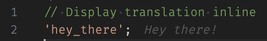
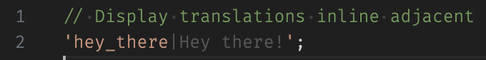
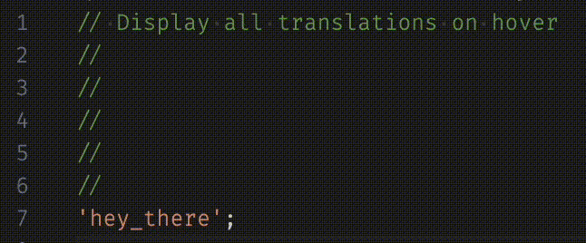

# Translations

This extension uses i18next to display localized text for translation keys in code.

## Setup

Several translation backends are supported and can be used in conjunction by updating the order in [Backend > List](#setting_list) setting.

A backend must be selected, otherwise no translations will be loaded.

Additionally, the [I18n Options](#setting_i18nOptions) settings are required unless the default suffices. [I18n Options > Namespaces](#setting_namespaces) are the possible namespaces, and [I18n Options > Supported Lngs](#setting_supportedLngs) are all the possible languages. Without these, the extension will not function properly.

### Contentful

To enable Contentful backend, add `contentful` to the [Backend > List](#setting_list) setting. Then fill in all the required settings in [Backend > Contentful Options](#setting_contentfulOptions).

### File System

To enable File System backend, add `fileSystem` to the [Backend > List](#setting_list) setting. Add the load path according to the [Backend > File System Options](#setting_fileSystemOptions).

## Features

- Inline translations

  - at the end of the line

    

  - adjacent to the key

    

- Translation on hover showing all translated values

  

## Extension Settings

- `translations.hover`
  - `enabled`: enable/disable display on hover over a localization key
- `translations.inline`
  - `enabled`: enable/disable inline value of key in default language
  - `position`: position to show the value of the key, either end of line or adjacent to key
- `translations.backend`
  - `list`: list of backends to use and the order in which to use them. Currently supports `File System` and `Contentful`. If more than one item exists in the list, the first will be primary and the rest used as a backup in the case of a missing key in the primary.
  - `fileSystemOptions`: options to pass to the file system backend, the following is required:
    - loadPath: the path from where to load translations. It contain `{{lng}}` and `{{ns}}`.
  - `contentfulOptions`: options to pass to the contentful backend, the following are required:
    - host: either `https://cdn.contentful.com` or `https://preview.contentful.com`
    - environment: "master" or another environment
    - space: the contentful space id to use
    - accessToken: the access token generated in Contentful settings.
- `translations.i18nOptions`
  - `namespaces`: namespaces to search for translations
  - `supportedLngs`: list of all supported languages for translating purposes
  - `defaultNs`: default namespace for translations, will default to `translation`
  - `fallbackLng`: fallback language for translations, defaults to `en-US`

## Known Issues

## Release Notes

[Releases](https://github.com/quinton22/vscode-translations/releases)

<!--
Ensure that you've read through the extensions guidelines and follow the best practices for creating your extension.

- [Extension Guidelines](https://code.visualstudio.com/api/references/extension-guidelines)
-->
